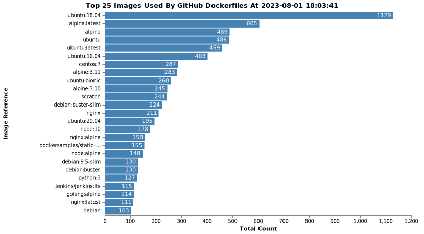

<h1 align="center"> Customs </h1>

海关(Customs) - Github Action 自动化 镜像数据收集与分析，为云安全研究提供数据支持。
[Open the Chart in the Vega Editor](https://vega.github.io/editor/#/url/vega/N4KABBYEQCQM4GMAWBTAtgQygLmkgLvgA5zYD0ZAbigOYYB0NAlvkgK4BG9TA9mYqkxVaGKgFZ6AKzg8AdlAA04SFAAmKRACcmRfL3m4oAQTAcMcJglMZNYZDfxgUADwxoiAGxQKwAdxZIYJQYHmwoYB4YHCgecGBwSDy+smBsRHJgaDxscOGJ1Jr0isoQUP6qrDhgACwADLVKkHgoTDQEVQBM9Y0qRBiqqkyyNFViPaWqGPhYuADaJU1goIsr0LJuKFVQ0xxexauLUMGhGlXzBwfLF9dQCFO0PJoAnltG+9cXUG7ZsvidABwLD5gAC+42BSyBENKd3wD2eWwAQu9oU0vlk2L9RmIodcwbiLldUSpYfCXoYAMIo4nQb6Yv64aoAZgJB3xxKJNNu9xoj3J0AAItTieifgywABOACMrNW7NRnJFpN5CMMAFFhajRfSqv8ZcT5dDFVrlXytgAxTXQ7VY3BiFkG8HA43W02q6AAcStEJt4qlEtlK0NEJdPrd-KgAAlvcDfbqAOyBxYgpMAXQJKaaqfBUAsNHWsTOBNDaPWaE2hnwPB4Hj0RBjKmOYSqwGDBygciLHKT7ZQ1F+cC2mhQCHw2AxuR4BQbNzSkzhW3nbDQUB7kDbHxLHygfZQA6HI7HE5Q2T+Tq1c-uW1bq4NaYzC2zC1zdy8g7mxaTUDLFegzkQISbOeKzbE8RC-lAZiyKoM7QKoPCYEMLZrhMUwzNAOx7MBnwAGZMDEMGGOGt4fBuIGaBgwwQeUlTYWifQDEMIy4LU9C1GMX6aD8hFgPgmhhBm2FbqUP5bE8AFYV+8GIQYkIivO6HbFEkkinhBFbHSWJJmRhyyJYv58WEdEqBRVFbKgrTtA+WY5hgzinB+lxfo8+G2tAHA8IQCGwS+gFbP+r6bIJn6xi5e7ilAXg4WeX4SRB4mBSRQaPjmmCaAA1u+YDnKswkYWBEHDqOPk4VxK64HlaIKVsmFBcCOlonuCA8OoyEiuFKCaG1NKlM43U9WicX+UNxnWmpHg8dycIqi8KHJqNnw0Ug-UDaUQ2GAFfkLbGUE8fqA0Ndu-KVdu63QAlW1ze242TZpfxXeu22rFATwdCtq2+XshgXSpq2NiEzYsQ9ECZqih0gZeC4VcD0B4R4HjvQNRwAxBcBwjEuzNjDoPQuDhz5J1iNjUw8NE1yTaFSgMHY3NOMXHTTQ6XloHgTVLgxbGTUtb+J2lB1XXQx9IStLJvOfBTWwIPzSU0nj7ZmLkHhDDzMNohLhgeV5K7Y09IFwwjgt-aU6vQAAxEyFsy3ejpzVAkMqx9fWG0bn0QZtv0u3mBY1dWtY6PQxG658u1VKxOKrXLz3HarKhnS9I0x2tIshD7NZ1vQd2waFOE4bk4oALQdDrMPbOzZMil7KeVr76eZ8XH36wA8n0CAsPyOVG2LsZwmji5TMuYAALzD7xNc6FnWom7UiegkHTlGyBJv7UbDOoum1ukdZkDpiCQA/view)

<!-- replace column -->
## 2023-08-01
<!-- replace column end -->

## 数据来源

### GitHub
基于`GitHub GraphQL API v4`, 获取每天创建的仓库中存在的`Dockerfile`，通过`REST API`去定向搜索`FROM`字样并解析内容，记录统计数据。

依此来绕过`search code API`最多只能获取到1000个的限制。

## 一些存在的问题：

很多repo没有indexed，导致搜索时报错：

`This repository's code is being indexed right now. Try again in a few minutes.`

search接口的limit为 10次/分钟，只能依照这个速率进行爬取。