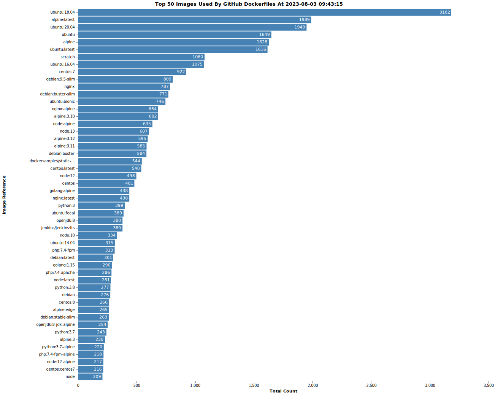

<h1 align="center"> Customs </h1>

海关(Customs) - Github Action 自动化 镜像数据收集与分析，为云安全研究提供数据支持。

## 数据统计

## 数据来源

### GitHub
基于`GitHub GraphQL API v4`, 获取每天创建的仓库中存在的`Dockerfile`，通过`REST API`去定向搜索`FROM`字样并解析内容，记录统计数据。

依此来绕过`search code API`最多只能获取到1000个的限制。

## 一些存在的问题：

很多repo没有indexed，导致搜索时报错：

`This repository's code is being indexed right now. Try again in a few minutes.`

search接口的limit为 10次/分钟，只能依照这个速率进行爬取。